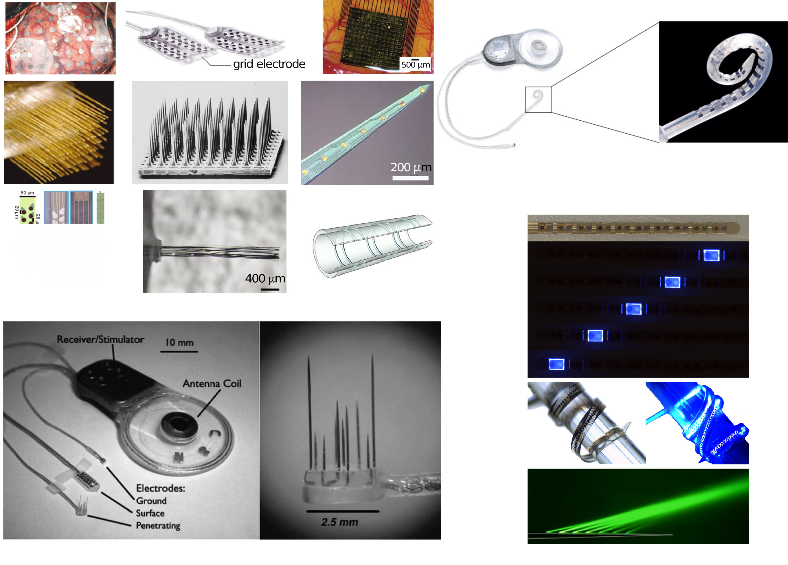
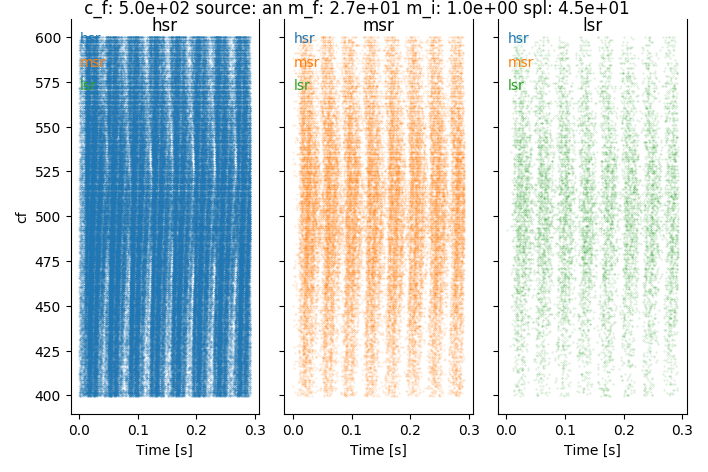
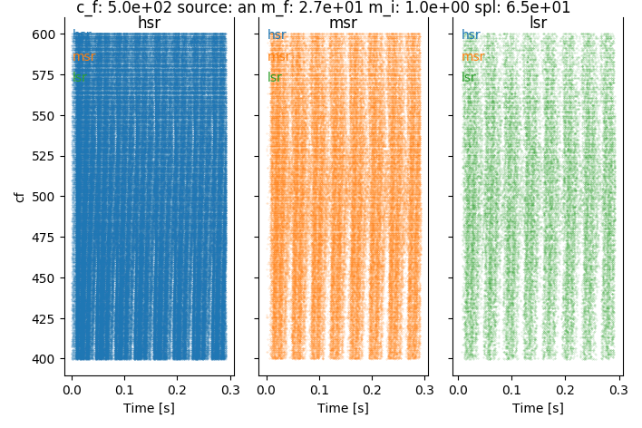
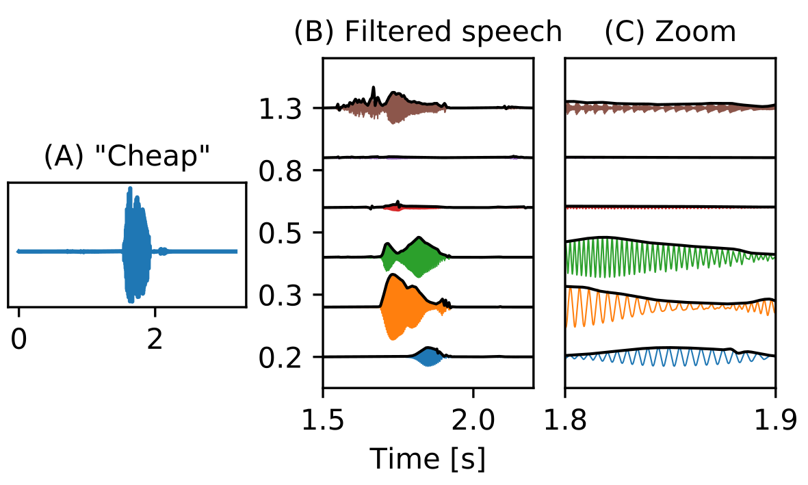
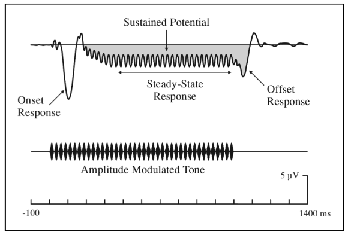
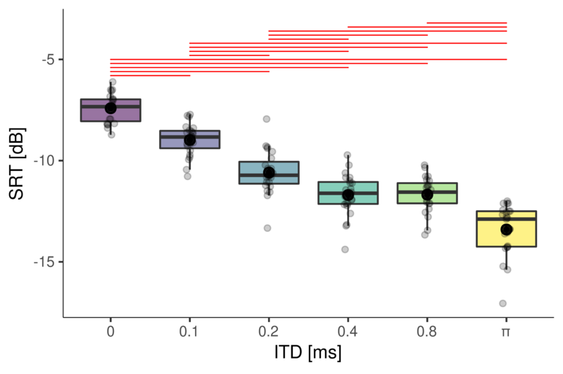
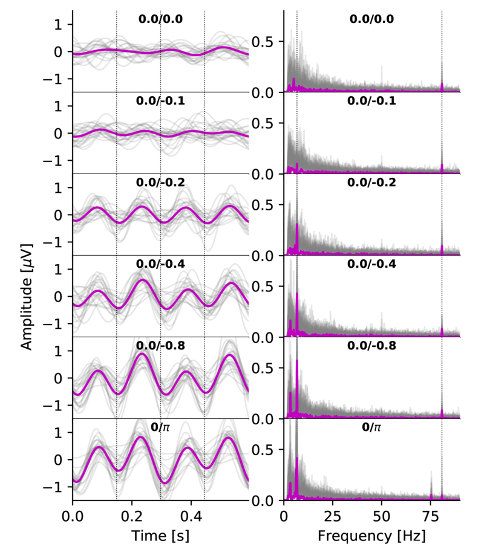
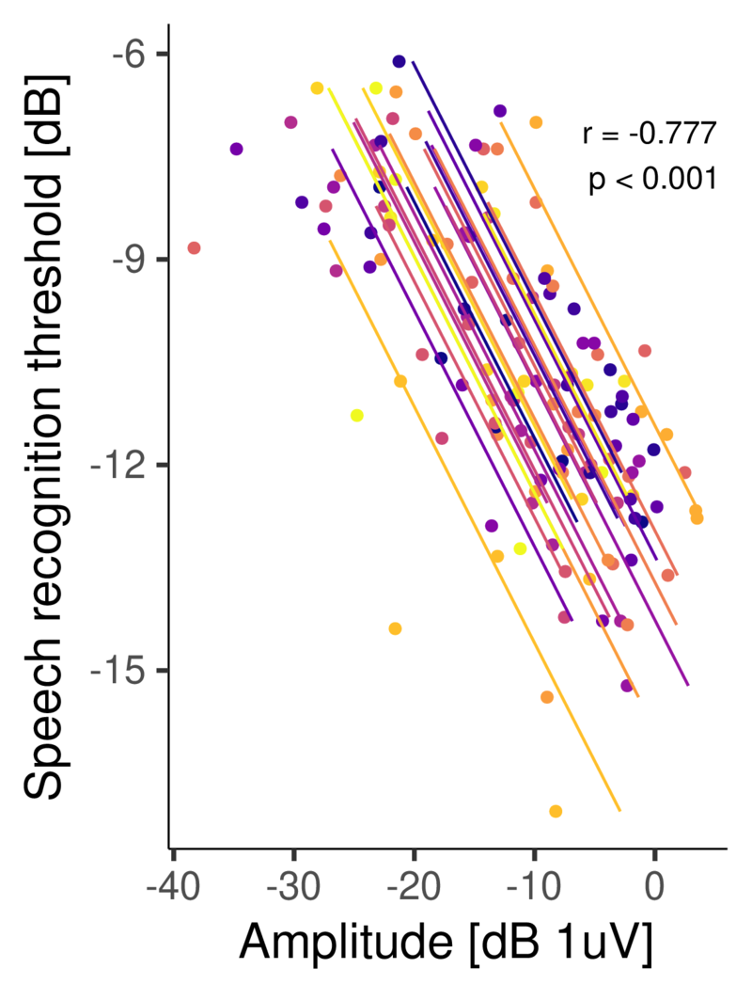
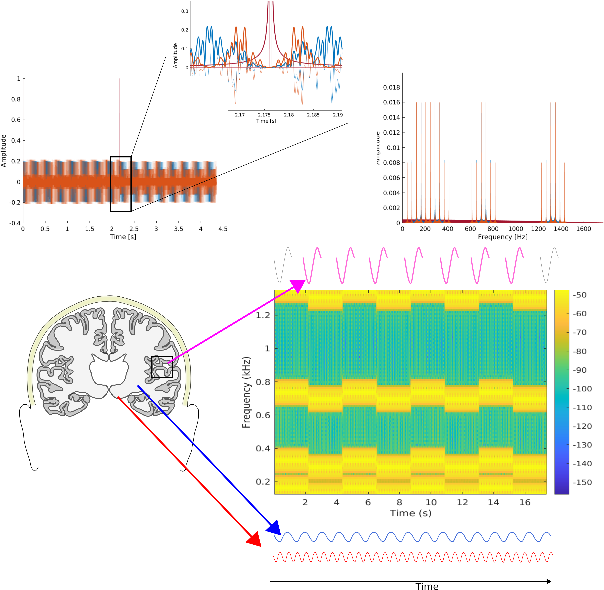

```{r setup, include=T, echo=FALSE}
knitr::opts_chunk$set(echo=FALSE, warning=FALSE, message=FALSE, kfigr.prefix=TRUE, kfigr.link=TRUE, comment=NA)
library(qrcode)
```

## Before starting

This lecture is optimized for **Google Chrome** and it can be found at

<center>
https://jundurraga.github.io/DTU2022/#/
</center>

<center>
```{r qr_code, eval=T, echo=F, fig.cap="", fig.width=6, fig.height=2.5}
plot(qr_code('https://jundurraga.github.io/DTU2022/#/'))
```
</center>


A printable version of this presentation can be obtained at

<center>
https://jundurraga.github.io/DTU2022/?print-pdf#/
</center>


# Introduction

## Neural interfaces

- Advancements in electronics able to interface with the nervous system is a rapidly advancing.
The implications of these technologies reach basic sciences and medical applications.

- Furthermore, neural interfaces can provide a direct, electrical bridge between the nervous systems and machines with the potential of transferring information in one or both directions.


<center>
{width="70%"}
</center>

<center>
From @chaudharyBrainComputerInterfaces2016
</center>

<!-- ## History -->

<!-- - 1791 "De viribus electricitatis in motu muscolari. Commentarius" Galvani applied charges to the nerves of dead frogs’ muscles and observed contractions. -->

<!-- <center> -->
<!-- {width="20%"} -->
<!-- <center> -->

<!-- - 1949 voltage clamp technology -> Hodgkin and Huxley to record currents carried by sodium and potassium ions through nerve cell membranes using electrochemical gradients. -->

<!-- - 1952 @hodgkinQuantitativeDescriptionMembrane1952 model mathematically describes the membrane potentials using a resistor–capacitor (RC) circuit model -->

<!-- - 1957 André Djourno and Charles Eyriès first human cochlear implant experiment -->

<!-- - 1961 William House first cochlear implantation -->

<!-- - 1978 First multiple channel CI was implanted into deaf volunteer -->

<!-- - 1991 [Utah](https://www.blackrockmicro.com/electrode-types/utah-array/) electrode array -->

<!-- - 1997 Deep brain stimulation for Parkinson’s Disease -->

<!-- - 2002 closed-loop brain machine interfacing in monkeys -->

<!-- - 2009 [BrainGate2](https://www.braingate.org): brain implant system built designed to help those affected by neurologic disease or injury. -->

<!-- - 2013 Responsive Neurostimulation (RNS) for epilepsy [@thomasCriticalReviewResponsive2015] -->

<!-- - 2013 FDA Approves First Retinal Implant (Argus II) -->

<!-- - 2019 [Neuralink](https://www.neuralink.com/) 3,072 electrode array [@muskIntegratedBrainmachineInterface2019] -->


## Hodgkin and Huxley model

<div class='multiCol'>
<div class='col'>

<center>
$C_{m}\frac{dV}{dt} = I_{Na} +  I_{K} + I_{leak} + I_{syn}$
</center>

<center>
$I_{Na} = \bar{g}_{Na} m^3 h \left(E_{Na} - V\right)$
</center>

<center>
$I_{K} = \bar{g}_{K} n^4 \left(E_{K} - V\right)$
</center>

<center>
$I_{leak} = \bar{g}_{leak} \left(E_{leak} - V\right)$
</center>

<center>
$I_{syn} = \sum_{i=1}^{n_{syn}} g_{syn_i} V$
</center>

</div>
<div class='col'>
<video src="./my_figures/41592_2020_762_MOESM6_ESM.mp4" type="video/mp4" controls height="200" width="200" preload="auto">
</video>
<center>
Glutamate transients 
</center>

</div>
</div>


<center>
{width="100%"}
<center>

The Hodgkin-Huxley model is the central pillar of modern neuroscience research.
It implications range from molecular investigations of the structural basis of ionic channels to the basis of neural interfacing with technology. 

## Hodgkin and Huxley simulator 

**[Try this simulator](http://myselph.de/hodgkinHuxley.html)**. Set random current (IRand) to zero, current injection stop-time (tInjStop) to 50, current amplitude (IDC) to 10  and  **investigate what is the effect on the neuron's threshold and spike morphology when changing**

- pulse parameters:  duration, amplitude 
- maximum conductances: sodium (GNaMax), potassium (GKMax), leak (Gm)
- reversal potentials: sodium (ENa), potassium (EK)

<iframe width="800" height="600" marginheight="0" marginwidth="0" src="http://myselph.de/hodgkinHuxley.html" data-preview-link="true">
</iframe>


# Non-invasive Neural Interfaces

## Types of neural interfaces

{width="100%"}

- Functional Near Infrared Spectroscopy (fNIRS)
- Functional magnetic resonance imaging (fMRI)
- Magnetoencephalography (MEG)
- Electroencephalogram (EEG)

## Recording

A neural interface builds a bidirectional communication channel between a subject’s nervous system and a man-made device.
Non-invasive methods measure the compound extracellular activity of hundreds of thousands neurons.


<div class="column" style="float:left; width:60%; text-align: center">

{width="70%"}
</div>
<div class="column" style="float:right; width:40%; text-align: center">


**Indirect**: 

Blood oxygen level dependent response (BOLD): a proxy measure of neural activity - **neurovascular link**

- Functional magnetic resonance imaging (fMRI)
- Functional Near Infrared Spectroscopy (fNIRS)

**Direct:**

Electrical currents

- Electroencephalogram (EEG)
- Magnetoencephalography (MEG)

**Advantages** 

- No surgery is required
- Easy to upgrade

**Disadvantages**

- Weak amplitude
- It may be difficult to achieve good contact between the sensor and the scalp (high impedance)
- Sensitive to endogenous contamination (movements, external noise)
- Portability is an issue

</div>

## Stimulation

<div class='multiCol'>
<div class='col'>
{width="100%"}
</div>
<div class="col">
- Transcranial current stimulation (TCS)
- Transcranial magnetic stimulation (TCS)
- Transcranial focused ultrasound (TFS)
- Transcranial photobiomodulation (tPBM)

**Advantages**

- No surgery required

**Disadvantages**

- Poor spatial resolution and low control
- Limited time 
- Portability is an issue


Is there more? 


</div>
</div>


# Invasive Neural Interfaces 

## Types of neural interfaces

<center>
{width="70%"}
</center>

- Non-penetrating electrodes: Electrocorticography (ECoG), Flexible μECoG electrodes (spatial resolution $\le$ millimetre range)
- Penetrating electrodes
- Optical electrodes

## Recording

<div class='multiCol'>

<div class="column" style="float:left; width:60%; text-align: center">

</center>
{width="100%"}
<center>
</div>

<div class="column" style="float:right; width:40%; text-align: center">
<br>

**Advantages**

- High spatial and temporal resolution 
- Increased signal-to-noise ratio
- Possibility of stimulating and recording neural activity simultaneously

**Disadvantages**

- Require surgery 
- Damage of neural and vascular structures
- Risk that any head trauma may damage the device
- Compatibility issues with other systems (e.g. MRI).

</div>

## Stimulation 

- Biphasic stimulation is the most commonly use pulse shape

<center>
{width="80%"}
</center>
<!-- {width="100%"} -->

<br>

- Several pulse shapes 
- Several stimulation modes (Monopolar, biopolar, multipolar)
- Several parameters (pulse width, rate, amplitude, polarity)

# Encoding of sounds

## Monaural Pathway

<center>

</center>

## Monaural Pathway

<center>


<br>

</center>


## Coding at moderate intensity levels

- 500 Hz tone modulated at 40 Hz at *25 dB SPL*

<center>
{width="70%"}
</center>

 
## Coding at moderate-to-middle intensity levels
 
- 500 Hz tone modulated at 40 Hz at *45 dB SPL*
<center>
{width="70%"}
</center>


## Coding at middle intensity levels

- 500 Hz tone modulated at 40 Hz at *65 dB SPL*
<center>
{width="70%"}
</center>


- Cochear synaptopathy reduces the ability to encode sound envelopes, specially at at higher inentensity levels.


## Input to one ear

<center>

<br>
{width="40%"}
<br>
Output at the auditory nerve level
<br> 
{width="40%"}
</center>


## Which features are conveyed by speech sounds?

- Temporal fine structure (TFS)
- Envelope information (ENV)

<li class ="fragment" data-fragment-index="0" data-audio-src="./audio/vocoder_ch_6_arctic_a0008.wav" data-audio-advance=-1> Play 6 Channel vocoder </li>
<li class ="fragment" data-fragment-index="1" data-audio-src="./audio/original_arctic_a0008.wav" data-audio-advance=-1> Play Original </li>

<center>
{width="60%"}
</center>


# Objective detection of auditory processing in humans

## Electroencephalogram (EEG)

- EEG allows to record electrical activity of the brain by means of electrodes placed along the scalp.

<center>
{width="60%"}
</center>


## EEG principle

<center>
{width="50%"}
</center>

<center>
(From Luck 2005)
</center>

## General problem 

<center>
{width="80%"}
</center>

## Auditory evoked potentials


<center>
{width="50%"}
</center>

## Transient and sustained response
<center>
{width="60%"}
</center>

## Lab settings

<center>
{width="50%"}
</center>

<center>
{width="50%"}
</center>


## Realtime processing

<video width="100%" height="100%" controls source src="./my_figures/eeg_example.mp4" type="video/mp4">


## Auditory brainstem responses (ABRs)

<div class="column" style="float:left; width:30%; text-align: center">
<center>
{width="100%"}
</center>
</div>

<div class="column" style="float:right; width:70%; text-align: center">
<video src="./my_figures/abr_example2.mp4" type="video/mp4" controls height="600" width="900" preload="auto">
</video>
<center>
</div>

## 80 Hz auditory steady-state responses (ASSRs)

<div class="column" style="float:left; width:30%; text-align: center">
<center>
{width="100%"}
</center>
</div>

<div class="column" style="float:right; width:70%; text-align: center">
<video src="./my_figures/80hz_assr_example2.mp4" type="video/mp4" controls height="600" width="900" preload="auto">
</video>
<center>
</div>

## 40 Hz ASSR

<div class="column" style="float:left; width:30%; text-align: center">
<center>
{width="100%"}
</center>
</div>

<div class="column" style="float:right; width:70%; text-align: center">
<video src="./my_figures/40hz_assr_example2.mp4" type="video/mp4" controls height="600" width="900" preload="auto">
</video>
<center>
</div>

## Cortical responses to auditory changes

<div class="column" style="float:left; width:45%; text-align: right">

**Spectral cues**

{width=100%}

- Transient auditory complex change (ACC) responses to speech, electrodes changes, and temporal cues (@kimAcousticChangeComplex2015, @mathewDevelopmentElectrophysiologicalBehavioural2018)

- Steady-state auditory change following responses (AC-FR) @undurragaNeuralEncodingSpectroTemporal2020


</div>

<div class="column" style="float:right; width:45%; text-align: right">

**Binaural cues**

{width=100%}

@undurragaNeuralRepresentationInteraural2016

</div>

## Cortical responses to binaural auditory changes

<div class="column" style="float:left; width:100%; text-align: right">

||||
|-|-|-|
|<video width="320" height="240" controls source src="./my_figures/example-90.0_90.0.mp4" type="video/mp4">| <video width="320" height="240" controls source src="./my_figures/example-45.0_45.0.mp4" type="video/mp4">|<video width="320" height="240" controls source src="./my_figures/example-22.5_22.5.mp4" type="video/mp4">|

</div>


## Transient ACC responses to binaural cues

<div class="column" style="float:left; width:30%; text-align: center">
<center>
{width="100%"}
</center>
</div>

<div class="column" style="float:right; width:70%; text-align: center">
<video src="./my_figures/acc_ipd_180_n_ch_4_n_comp_1_test_1_T8_EXG1_EXG2_EXG52.mp4" type="video/mp4" controls height="600" width="900" preload="auto">
</video>
<center>
</div>

## AC-FR responses to binaural cues

<div class="column" style="float:left; width:30%; text-align: center">
<center>
{width="100%"}
</center>
</div>

<div class="column" style="float:right; width:70%; text-align: center">
<video src="./my_figures/ipm_fr_example2.mp4" type="video/mp4" controls height="600" width="900" preload="auto">
</video>
<center>
</div>

# Objective detection and discrimination of binaural cues

## EEG Stimuli

- Amplitude modulated (80 Hz) bandpass noise (100 - 1000 Hz) at 65 dB SPL.
- Interaural time modulations (ITM) presented at a rate of 6.7 Hz
- ITM consisted of: 0/0 (diotic), 0/0.1 ms, 0/0.2 ms, 0/0.4 ms, 0/0.8 ms, and antiphasic condition.

<center>
{width="50%"}

## EEG processing

- Data referenced to Cz and  down-sampled to 1024 samples per second

- Poor electrode were automatically detected and removed

- Eye blink artifacts were removed using a template matching suppression method <font size="3">(Valderrama et al., 2018)</font>

- Data filtered using a FIR Kaiser filter (−65 dB ripple and 1 Hz transition between pass and stop band)

- Epochs were sorted and de-noised using spatial filtering <font size="3">(de Cheveigné and Simon, 2008)</font>

- Epochs averaged using a weighted averaging method <font size="3"> (Don and Elberling, 1994) </font>

- Frequency response (FFT of 4255 points at 0.24 Hz resolution) and tested using Hotelling’s T-squared test <font size="3"> Picton et al. (1987) and Picton et al. (2003)</font>


## Behavioural Measures

**Digits in noise test**

- Adaptive staircase procedure (2-down/1-up) with variable adaptive step (Leek, 2001; Denys et al. 2019)
- Three randomly chosen digits were presented in background speech shaped noise. 
<center>
{width="60%"}
<br>
{width="30%"}
</center>

## Behavioural methods

- Initial step size: 6 dB first two reversals; 3 dB next two reversals, and 2 dB last six reversals.

- Noise was presented diotically (i.e. identical signal in both ears) at 65 dB SPL. 

- Digits were presented using several **ITDs: 0, 0.1, 0.2, 0.4, 0.8 ms**. In addition, digits were also presented having the opposite polarity in both ears - **antiphasic**.

- 3 runs were obtained per ITD (starting SNR at 10 dB and -30 dB).

- All were presented in random order.


## Speech reception thresholds
<center>
{width=45%}
{width=45%}
</center>

## EEG responses

<center>
{width="55%"}
{width="15%"}

## SRT vs EEG

<center>
{width="45%"}
{width="45%"}
</center>

# The project

## Spectral cues

- Spectral cues are critical for communication
- Information used to distinguish between speech sounds can be represented by specifying peaks in the frequency spectrum
- First (F1) and second (F2) formants are mostly sufficient to identify a vowel

<center>
{width="50%"}
</center>

## Objective detection of discrimination

- Objective detection of spectral discrimination could be useful for the fitting of hearing devices (@undurragaNeuralEncodingSpectroTemporal2020).
- Support decision-making for hearing aid fitting and CI referral (for the parents and audiologists) (@mehtaRoleCorticalAuditory2017a).

**Aim**

To demonstrate objectively that phoneme-like signals (speech) can be discriminated.

## Methods

<div class="column" style="float:left; width:60%; text-align: center">

- Two complex signals with different spectral components alternate periodically.
- Identical energy for the two signals.
- Different amplitude modulations (AMs) imposed to each ear to evoked auditory steady-state responses (ASSRs) to each AM.
- Cortical auditory change complex generated by each transition


{width="90%"}

</div>

<div class="column" style="float:right; width:40%; text-align: center">

<ui class="fragment" data-fragment-index="0" > Examples </ui>
<li class="fragment" data-fragment-index="1" data-audio-src="./audio/40_40.wav" data-audio-advance=-1> 40 Hz - 40 Hz </li>
<li class="fragment" data-fragment-index="2" data-audio-src="./audio/40_80.wav" data-audio-advance=-1> 40 Hz - 80 Hz </li>

</div>

## Methods

<div class="column" style="float:left; width:60%; text-align: center">

**EEG**

- **Continuous stimulation**
- EEG: 8 channels Biosemi system.
- Stimuli presentation via [AEP GUI](https://gitlab.com/jundurraga/ucl-matlab) 
- Real-time analysis [Biosemi real-time GUI](https://gitlab.com/jundurraga/biosemi_real_time) 
- Analysis [PyEEG-Python](https://gitlab.com/jundurraga/pyeeg-python) 

**Stimuli** 

Consider different aspects 

- Intensity
- Spectral components
- Modulation Frequencies
- Artefacts
- Optimal parameters

</div>

<div class="column" style="float:right; width:40%; text-align: center">
{width="100%"}
</div>

## References
